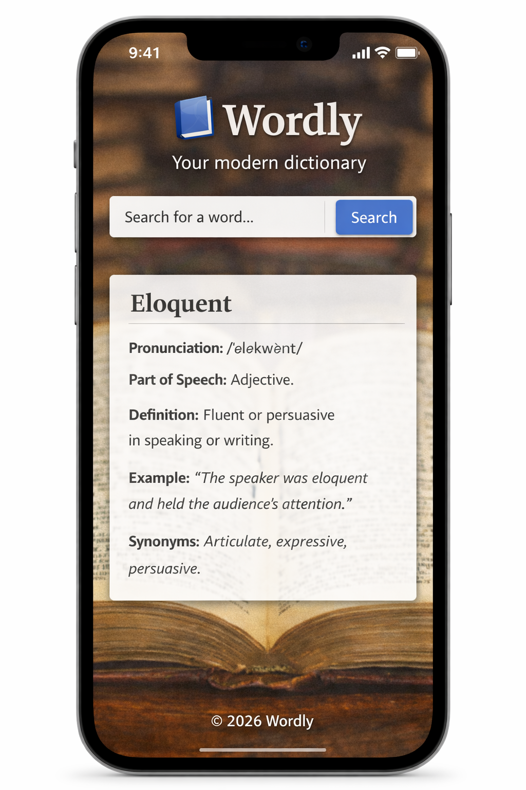

# 📘 Wordly – Dictionary Single Page Application (SPA)

## Application Preview

## Project Overview
Wordly is a Single Page Application (SPA) built using **HTML, CSS, and JavaScript**. The application allows users to search for a word and retrieve dictionary information such as pronunciation, definitions, part of speech, example usage, and synonyms. The app dynamically fetches data from an external Dictionary API and updates the page without reloading.

This project was developed as a summative lab to demonstrate core JavaScript skills, API integration, DOM manipulation, and modern web development practices.

---

## Features
- Search for word definitions using an external dictionary API
- Display pronunciation, definition, part of speech, examples, and synonyms
- Single Page Application (SPA) behavior (no page reloads)
- Dynamic DOM manipulation using JavaScript
- Error handling for invalid words or failed API requests
- Light/Dark theme toggle using JavaScript and CSS variables
- Clean and responsive user interface

---

## Technologies Used
- **HTML5** – Structure and layout
- **CSS3** – Styling and theme management
- **JavaScript (ES6+)** – Application logic and interactivity
- **Fetch API** – External API communication
- **Dictionary API** – https://dictionaryapi.dev/

---

## Project Structure

---

## How to Run the Project
1. Download or clone the repository.
2. Open the project folder.
3. Open `index.html` in any modern web browser.
4. Enter a word in the search box and click **Search**.

> No additional installation or dependencies are required.

---

## How the Application Works
1. The user enters a word into the search form.
2. JavaScript listens for the form submission event.
3. A fetch request is sent to the Dictionary API.
4. The API response is processed and relevant data is extracted.
5. The results are dynamically displayed on the page.
6. If the word is not found or the request fails, an error message is shown.

---

## Error Handling
- Displays a user-friendly message when a word is not found.
- Handles network or API request failures gracefully.
- Prevents empty searches from being submitted.

---

## Problem-Solving Approach
This project followed a structured development process:
1. Analyze project requirements
2. Define scope and features
3. Design the UI structure
4. Implement core functionality
5. Integrate external API
6. Test, debug, and refine
7. Produce a maintainable final solution

---

## Future Enhancements
- Save searched words using localStorage
- Add audio pronunciation playback
- Display multiple definitions per word
- Improve accessibility and animations
- Add loading indicators

---

## Author
## Author

## Author

My name is **Ebrahim Ogejo**, and this project was developed as part of a JavaScript summative lab to demonstrate my understanding of modern web development principles. **My Wordbook** represents a practical application of the skills I have acquired, including problem analysis, structured planning, API integration, event-driven programming, and dynamic manipulation of the DOM.

In building this Single Page Application, I focused on creating a solution that is not only functional, but also clean, intuitive, and maintainable. The project reflects my growing ability to translate requirements into a complete, user-friendly web application while adhering to best practices in HTML, CSS, and JavaScript.

**My Wordbook** marks an important milestone in my development journey and serves as a portfolio-ready example of my capability to build interactive, data-driven applications with a strong emphasis on user experience and modern design standards.

---

## License
This project is for educational purposes only.
